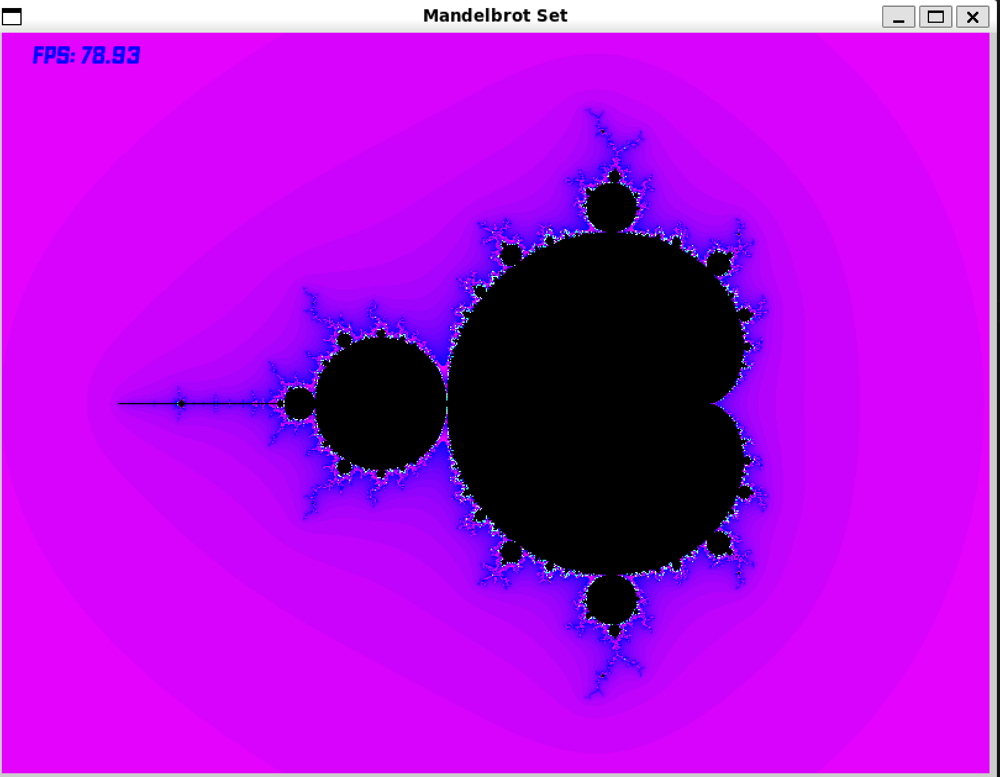
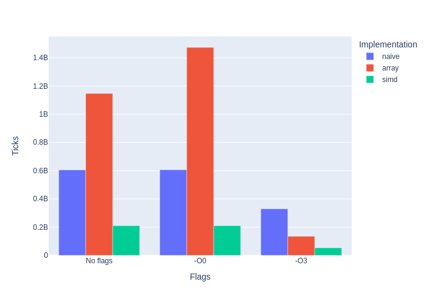
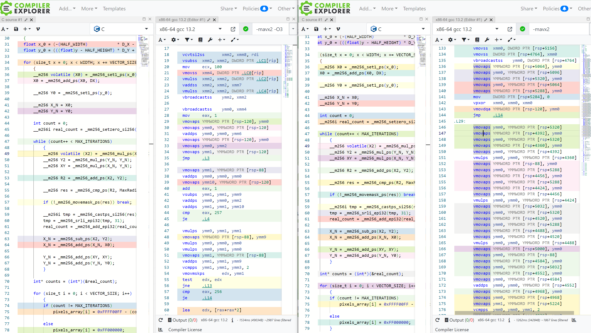
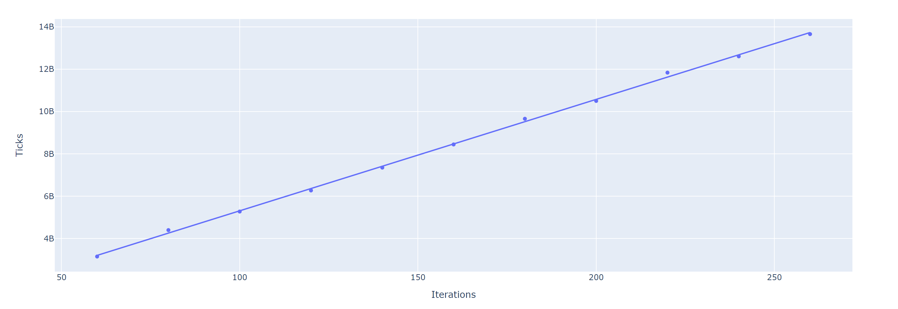
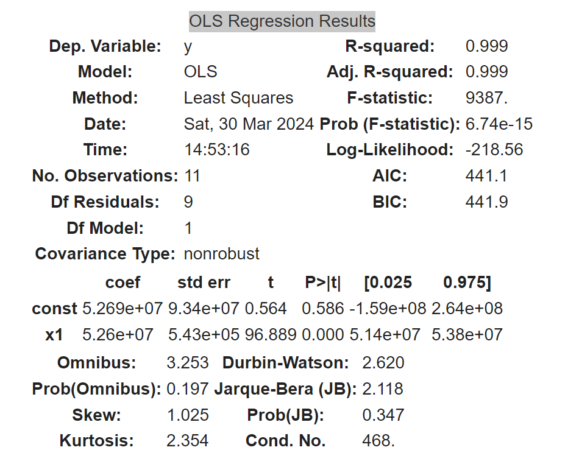
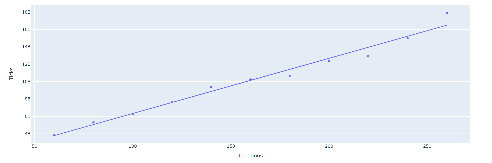
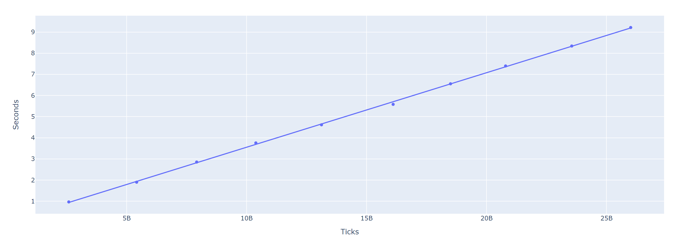

# Исследование эффективности SIMD-инструкций
## Описание проекта
В данном проекте было осуществлено сравнение различных алгоримтов построения множества Мандельброта (подробнее о нем ниже). А также оценка погрешности измерения времени при дополнительной нагрузке `CPU` и без нее и исследование вопроса точности измерения времени с помощью библиотеки `SFML`.
## Множество Мандельброта
Координаты точек множества Мандельброта удовлетворяют следующим уравнениям:
1) $x_{n+1}$ = $x_n^2 - y_n^2 + x_0$
2) $y_{n+1}$ = $2 * x_n * y_n + y_0$,

где (x0, y0) - координаты рассчитываемого пикселя.  

Цвет пикселя изображения зависит от количества итераций (`MAX_ITERATIONS = 256`), при которых точка находится внутри окружности данного радиуса (`MAX_RADIUS = 10`). Важно отметить, что, если точка отдалилась от центра окружности на расстояние большее, чем ее радиус, то дальше она будет удаляться в "бесконечность".

  

Таким образом, можно легко отследить области, в которых точка не вышла за пределы окружности (черный цвет) и наоборот (не черный цвет).

## Особенности и запуск программы
### Особенности
В данном проекте отлажено два режима работы:
1) **Графический режим**: открывается графическое окно размером `800x600`px, в котором визуализировано множество Мандельброта. В левом верхнем углу показывается FPS. Также поддерживается перемещение и изменение масштаба фигуры.
 
Горячие клавиши:
  
|   Клавиша   |   Действие    |
|------------:|:--------------|
| ↑           | Сдвиг вверх   |
| ↓           | Сдвиг вниз    |
| ←           | Сдвиг влево   |
| →           | Сдвиг вправо  |
| =           | Приближение   |
| -           |  Удаление     |  

2) **Тестовый режим**: запускается цикл расчета 80 кадров. Полученное значение делиться на количество итераций (80). В стандартный вывод печатается затраченное время расчета одного кадра, либо в секундах, либо в тиках процессора
в зависимости от режима измерения, выбранного пользователем.

В программе реализованы три различных метода построения данного фрактала:
  - **Naive** - обработка отдельно каждого пикселя.
  - **Array** - обработка за 1 итерацию цикла массива из 8 пикселей.
  - **Simd**  - обработка за 1 итерацию цикла 8 пикселей c использованием AVX инструкций, что позволяет добиться большей оптимизации.

### Запуск
Для того, чтобы собрать проект, нужно ввести команду:
```bash
make
```

Далее нужно вписать название `*.exe` файла и после него указать аргументы командной строки.  

Для того, чтобы запустить графическую реализацию нужно указать, какой метод построения вы хотите использовать (1 - `Naive`, 2 - `Array`, 3 - `Simd`).   

Пример запуска графической "наивной" реализации:
```bash
./mandle.exe 1  
```
  
Для того, чтобы запустить тестовую реализацию нужно указать дополнительный аргумент командной строки, который отвечает за то, в чем вы хотите получить результат (0 - `seconds`, 1 - `ticks`).  

Пример запуска тестовой "наивной" реализации с результатом в тиках процессора:
```bash
./mandle.exe 1 1
```
## Исследование производительности
### Оценка метода измерения
Измерение расчета 1 кадра мы будем получать в тактах процессора, используя функцию `__rdtsc()`. Данный метод является достаточно точным, поскольку `__rdtsc()` раскрывается в отдельную ассемблерную инструкцию (ее погрешность не превышает нескольких десятков тактов). Основную погрешность в измерения будут вносить прерывания, вызванные работой других процессов.   

Данные были получены для каждой версии алгоритма с каждым из уровней оптимизации:
 - **-O0**: оптимизация кода не производится. Исходный текст программы тривиальными преобразованиями перерабатывается в машинный код. Благодаря этому уменьшается время компиляции программы.
 - **-O3**: обычно применяются все доступные компилятору способы оптимизации.

Также были получены данные при запуске программы без применения этих флагов.  

### Обработка результатов
Для каждой серии измерений данные находятся в [таблице](data.md). Здесь будут усредненные значения, для нас они являются более важными.  

| Type\Flag       | No flags     |    -O0     |    -O3     |
|----------------:|:------------:|:----------:|:-----------|
|Naive            | 604848075    | 606626509  | 329874533  |
|Array            | 1146803707   | 1473241938 | 134850324  |
|Simd             | 210284913    | 210346435  | 53103567   |  

Для лучшего понимания визуализируем данные результаты с помощью гистограммы.
 
### Промежуточные итоги
1) Оптимизация с опцией `-O3` намного провосходит остальные в скорости, независимо от метода построения.
2) Заметная разница между `-O0` и `No flags` видна лишь в исполнении **Array** (без флага в 1.3 раза быстрее).
3) Использование **Simd**-оптимизации быстрее **Naive** в `6.2 раза`, а исполнения **Array** более, чем в `2.5 раза` (естественно с опцией `-O3`).
4) Реализация **Array** без опции `-O3` работает дольше, чем остальные.

### Почему без -O3 работает дольше?
Воспользуемся **Godbolt** и посмотрим, во что раскрывается функция c интринсиками с флагом -O3 и без него. Мы видим, что справа (версия без -O3) раскрывается в большое количество инструкций, а точнее использование `vmovaps`, так как задействуется меньшее количество регистров. А версия слева (версия с -O3) наоборот. Поэтому мы и получаем меньшее количество тактов процессора с флагом -O3.


### Оценка погрешностей
Я построил график зависимости количества пройденных тиков от числа итераций. С помощью данного графика, во-первых, мы можем еще раз убедиться в правильности полученных результатов (коэффицент наклона, как раз и показывает число тиков для расчета одного кадра). Во-вторых, мы сможем расчитать ошибку измерения. Данные измерения проводились для версии с AVX-инструкциями и опцией `-O3`. 
> [!NOTE]
> Для данного измерения, нам не нужно делить результат на количество итераций.

Данные поместим в таблицу и построим по точкам график:  

Iterations |	ticks
-----------|------------
60	        | 3155449318
80	        | 4402527890
100	       | 5278101261
120	       | 6273207990
140	       | 7352121648
160	       | 8444400690
180	       | 9656800244
200	       | 10499067161
220	       | 11835187248
240	       | 12603305246
260	       | 13652603782

  

Как мы видим, все точки хорошо лежат на аппроксимирующей прямой. Линейная зависимость подтверждена. Теперь приведу единственный раз полные сведения о графике, из которых нам нужны только два значения (coef-x1, std err-x1).



Полученный коэффицент угла наклона равен `5.26e+07`. Это значение отличается от того, что мы получили в прошлом пункте меньше, чем на `1%`. Так же мы видим ошибку измерения. Она также составляет примерно `1%`. Как я и говорил раньше, основной вклад в эту погрешность вносят прерывания, вызванные работой других процессов. Теперь я решил проверить, что будет, если дополнитено нагружать `CPU` во время расчета.

### Дополнительная нагрузка на CPU
Во время запуска программы я буду постоянно переключать основное окно. Ожидается, что вырастет и само количестве тиков и погрешность будет больше. Я получил следующие данные данные: 
  
Iterations	|   ticks
-----------|-------------
60	        | 3885686890
80	        | 5312054090
100	       | 6247557540
120	       | 7613164307
140	       | 9370196538
160	       | 10266402469
180	       | 10687673202
200	       | 12347056337
220	       | 12935510726
240	       | 15001979369
260	       | 17898862258

Также представим данные на графике:


Как мы видим, точки достаточно разбросаны, плохо лежат на аппроксимирующеся прямой. Ошибка измерений составила уже `5%`. Да и сами значения, как мы можем видеть больше, чем в предыдущем эксперименте. То есть наша теория подтвердилась. Но в моей работе время расчета кадра можно получить и в секундах, используя функцию `clock.getElapsedTime()`, которая возвращает прошедшее время между двумя метками времени.

### Оценка точности SFML в определении времени
Для решение данной задачи нужно сравнить `clock.getElapsedTime()` и `__rdtsc()`. Будем измерять время при разном количестве итераций расчета кадра. Данные занесем в таблицу: 

Iterations	|     ticks     |     seconds
-----------|---------------|----------------
50	        | 3885686890    |    0.967965
100	       | 5312054090    |    1.901002
150	       | 6247557540    |    2.853597
200	       | 7613164307    |    3.757666
250	       | 9370196538    |    4.614569
300	       | 10266402469   |    5.581246
350	       | 10687673202   |    6.552642
400	       | 12347056337   |    7.396119
450	       | 12935510726   |    8.339526
500	       | 15001979369   |    9.213634

Опять же представим данные в виде графика.

График получился линейным. При этом погрешность, которую мы ищем, находится из графика (пересечение с осью "y"). Из обработанных данных погрешность составила 0.0310. Но при этом ошибка измерения данного графика составляет приблизительно 0.04. То есть мы доказали, что погрешность `SFML` в вопросе измерения времени несущественна. И в данной задаче мы можем рассчитывать время с помощью `clock.getElapsedTime()`.
> [!NOTE]
> Все измерения были обработаны с помощью Python. Для более детального изучения можно обратиться к файлу `analys.ipynb`, который также находится в данном репозитории.

## Итоги
На основе промежуточных итогов, в результате данной работы, показано не только, что использование intrinsic функций способно многократно повысить производительность в хорошо параллелизируемых задачах, но и, что сам компилятор `gcc` не способен полностью оптимизировать код, написанный без ассемблерных вставок. Этот подчеркивает важность явных оптимизаций в коде. Также была доказана правильность использования `SFML` для расчета времени в данном проекте. И дополнительно исследовано, изменится ли погрешность при дополнительной нагрузке на `СPU`.   
В заключении, очевидно, что использование **Simd** предпочтительнее, поскольку прирост производительности во всех исполнениях выше. Но **Simd** подходит исключительно для определнной архитектуры (то есть не является кроссплатформенной). Поэтому использование каждого метода вполне возможно, смотря какие задачены поставлены.
